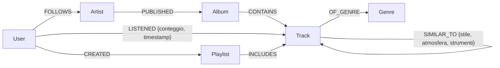

# Analisi Dati e Big Data — Progetto d'esame

Progetto d'esame per il corso **Analisi Dati e Big Data**. A partire dalle tracce
assegnate vengono realizzati **tre database di tipologia diversa**, ognuno
progettato, implementato, popolato con dati di esempio e interrogato tramite uno
**script Python**:

| # | Tipologia | Tecnologia | Tema / Traccia |
|---|-----------|------------|----------------|
| 1 | **Relazionale** | SQLite | Negozio di elettronica (clienti, prodotti, ordini) |
| 2 | **NoSQL a Grafo** | Neo4j | Piattaforma di streaming musicale (knowledge graph) |
| 3 | **NoSQL Documentale** | Elasticsearch | Personaggi di *One Piece* (traccia libera) |

Ogni progetto dimostra la capacità di **progettare** un database, **interrogarlo**
con query mirate e **interagire con esso da Python**.

---

## Struttura della repository

```
Analisi_Dati_Big_Data/
├── README.md                     ← questo file (panoramica globale)
├── Relazionale/                  ← DB relazionale (SQLite)
│   ├── 01_schema.sql             creazione tabelle
│   ├── 02_insert.sql             dati di esempio
│   ├── 03_queries.sql            query della traccia (+ aggiuntive)
│   ├── negozio.db                database già creato e popolato
│   ├── query_negozio.py          esecuzione query da Python
│   ├── presentazione.html        presentazione del progetto
│   └── ISTRUZIONI_DBEAVER.txt    guida passo-passo
├── Grafo/                        ← DB a grafo (Neo4j)
│   ├── 01_create.cypher          creazione nodi + relazioni
│   ├── 02_queries.cypher         query Cypher
│   ├── query_musica.py           esecuzione query da Python
│   ├── presentazione.html        presentazione (query dal vivo)
│   ├── README.md                 dettaglio del modello dati
│   └── ISTRUZIONI_NEO4J.txt      guida passo-passo
└── ElasticSearch/                ← DB documentale (Elasticsearch)
    ├── docker-compose.yaml       avvio Elasticsearch + Kibana
    ├── 01_index.txt              mapping dell'indice
    ├── bulk.ndjson               dataset (~1500 personaggi)
    ├── query_onepiece.py         creazione indice + query da Python
    ├── presentazione_elasticsearch.html   presentazione (query dal vivo)
    └── ISTRUZIONI_ELASTIC.txt    guida passo-passo
```

---

## Prerequisiti generali

- **Python 3** (per gli script `query_*.py`).
  - Il progetto relazionale usa solo la libreria standard (`sqlite3`).
  - Grafo: `pip install neo4j`
  - Elasticsearch: `pip install elasticsearch`
- **DBeaver** (opzionale) per esplorare il DB relazionale in modo visuale.
- **Neo4j Desktop** per il database a grafo.
- **Docker Desktop** per Elasticsearch (e Kibana).

Ogni cartella contiene un file `ISTRUZIONI_*.txt` con la procedura completa e
autonoma per replicare la pipeline (installazione → creazione → popolamento →
query).

---

## 1. Database Relazionale — Negozio di elettronica (SQLite)

**Traccia:** informatizzare la gestione di clienti, prodotti e ordini di un
negozio di elettronica, consentendo di conoscere i prodotti acquistati dai
clienti e il valore economico degli ordini.

### Schema

```mermaid
erDiagram
    CATEGORIE   ||--o{ PRODOTTI     : classifica
    FORNITORI   ||--o{ PRODOTTI     : fornisce
    CLIENTI     ||--o{ ORDINI       : effettua
    ORDINI      ||--o{ RIGHE_ORDINE : contiene
    PRODOTTI    ||--o{ RIGHE_ORDINE : compare_in

    CATEGORIE {
        int  codice_categoria PK
        text nome
    }
    FORNITORI {
        int  codice_fornitore PK
        text ragione_sociale
        text telefono
        text email
    }
    CLIENTI {
        int  codice_cliente PK
        text nome
        text cognome
        text email
        text telefono
        text citta
    }
    PRODOTTI {
        int  codice_prodotto PK
        text nome
        text descrizione
        real prezzo_unitario
        int  quantita_disponibile
        int  codice_categoria FK
        int  codice_fornitore FK
    }
    ORDINI {
        int  codice_ordine PK
        int  codice_cliente FK
        text data_ordine
    }
    RIGHE_ORDINE {
        int  codice_ordine PK-FK
        int  codice_prodotto PK-FK
        int  quantita
        real prezzo_applicato
    }
```

### Query principali (traccia)

1. Elencare tutti i prodotti acquistati da un determinato cliente.
2. Calcolare il totale speso da ciascun cliente.
3. Calcolare la spesa media mensile di ogni cliente per un anno di riferimento.

Sono incluse anche query aggiuntive (coppie di prodotti acquistati insieme,
inattività e valore per cliente).

### Come eseguire (in breve)

```bash
cd Relazionale
python query_negozio.py          # usa negozio.db; le query vengono stampate
python query_negozio.py --crea   # ricostruisce il DB da 01_schema.sql + 02_insert.sql
```

Guida completa (anche con DBeaver): [`Relazionale/ISTRUZIONI_DBEAVER.txt`](Relazionale/ISTRUZIONI_DBEAVER.txt).

---

## 2. Database a Grafo — Piattaforma musicale (Neo4j)

**Traccia:** costruire un *knowledge graph* che rappresenti artisti, album,
brani, generi e utenti, per esplorare affinità tra artisti, collegamenti tra
utenti con gusti simili e percorsi che suggeriscano nuovi brani.

### Modello dati



Sei tipi di nodo (`Artist`, `Album`, `Track`, `Genre`, `User`, `Playlist`) e otto
relazioni; **`LISTENED`** e **`SIMILAR_TO`** portano proprietà sugli archi.
Dettaglio completo del modello: [`Grafo/README.md`](Grafo/README.md).

### Query principali (traccia)

1. Brani consigliati in base agli artisti seguiti e ai generi più ascoltati.
2. Artisti collegati indirettamente perché ascoltati dagli stessi utenti.
3. Artisti a 2 hop di distanza (`Utente → Artista ← Utente → Artista`).

In più: filtering collaborativo, gradi di separazione (`shortestPath`), brani
simili via `SIMILAR_TO` e ascolti recenti via `timestamp`.

### Come eseguire (in breve)

```bash
cd Grafo
pip install neo4j
python query_musica.py --crea    # popola il grafo da 01_create.cypher
python query_musica.py           # esegue e stampa le query
```

Richiede un DBMS Neo4j avviato con password `12345678` (o aggiornare `AUTH` in
`query_musica.py`). Guida completa: [`Grafo/ISTRUZIONI_NEO4J.txt`](Grafo/ISTRUZIONI_NEO4J.txt).

---

## 3. Database Documentale — One Piece (Elasticsearch)

**Traccia libera.** Ogni personaggio di *One Piece* è un documento JSON autonomo
(nessuna tabella, nessun join). Il modello mette in risalto la **ricerca
full-text** sul campo `description` e le **aggregazioni** (es. taglia media per
ciurma).

### Struttura del documento

| Campo | Tipo ES | Descrizione |
|-------|---------|-------------|
| `name` | `text` | nome del personaggio |
| `crew` | `keyword` | ciurma / organizzazione |
| `origin` | `keyword` | mare/luogo di origine |
| `bounty` | `long` | taglia in berry |
| `devil_fruit` | `keyword` | frutto del diavolo (se presente) |
| `role` | `keyword` | ruolo nella ciurma |
| `status` | `keyword` | Alive / Deceased / Unknown |
| `description` | `text` | descrizione testuale (full-text search) |

Dataset: **~1500 documenti** in `bulk.ndjson`.

### Query di esempio

- Full-text `multi_match` con `fuzziness` e `highlight`.
- Filtro `term` (membri di una ciurma).
- `range` (taglia superiore a 1 miliardo).
- Aggregazione `terms` + `avg` (taglia media per ciurma).

### Come eseguire (in breve)

```bash
cd ElasticSearch
docker compose up -d             # avvia Elasticsearch (+ Kibana)
pip install elasticsearch
python query_onepiece.py --carica   # crea l'indice e carica i documenti
python query_onepiece.py            # esegue e stampa le query
```

Elasticsearch risponde su `http://localhost:9200`, Kibana su
`http://localhost:5601`. Guida completa: [`ElasticSearch/ISTRUZIONI_ELASTIC.txt`](ElasticSearch/ISTRUZIONI_ELASTIC.txt).

---

## Presentazioni

Ogni cartella contiene una presentazione HTML apribile nel browser. Le
presentazioni di Grafo ed Elasticsearch eseguono le query **dal vivo** sul
database (richiedono quindi il rispettivo servizio avviato).
