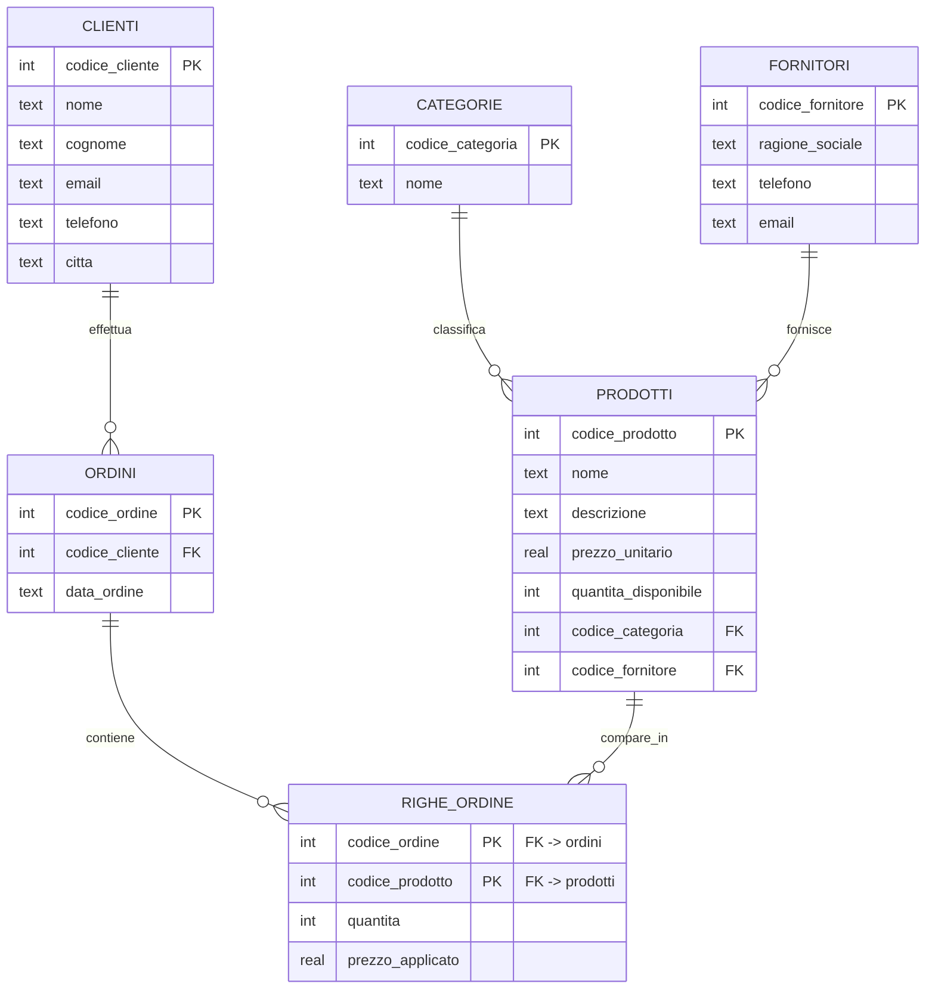

# Negozio di elettronica — DB Relazionale (SQLite)

Progetto d'esame *Analisi Dati e Big Data*: un database **relazionale** su SQLite
che informatizza la gestione di **clienti, prodotti e ordini** di un negozio di
elettronica, permettendo di conoscere i prodotti acquistati da ciascun cliente e
il valore economico degli ordini.

## File del progetto

| File | Contenuto |
|------|-----------|
| `01_schema.sql` | Crea le 6 tabelle (con vincoli e chiavi esterne). Parte con i `DROP TABLE` per ripartire da zero. |
| `02_insert.sql` | Popola il database con i dati di esempio. |
| `03_queries.sql` | Le query della traccia + alcune query aggiuntive. |
| `negozio.db` | Database SQLite già creato e popolato. |
| `query_negozio.py` | Script Python che si connette al DB ed esegue le stesse query. |
| `presentazione.html` | Presentazione del progetto (apribile nel browser). |
| `ISTRUZIONI_DBEAVER.txt` | Guida passo-passo (DBeaver e Python). |

## Il modello dati

Sei tabelle. Ogni **prodotto** appartiene a una **categoria** ed è fornito da un
**fornitore**; ogni **ordine** è effettuato da un **cliente** e si compone di una
o più **righe d'ordine**, ciascuna riferita a un prodotto con quantità e prezzo
applicato al momento dell'acquisto.



### Tabelle

| Tabella | Descrizione | Chiavi esterne |
|---------|-------------|----------------|
| `categorie` | Categorie di prodotto (smartphone, notebook, accessori…) | — |
| `fornitori` | Fornitori dei prodotti | — |
| `clienti` | Anagrafica clienti | — |
| `prodotti` | Prodotti a catalogo | → `categorie`, `fornitori` |
| `ordini` | Ordini effettuati dai clienti | → `clienti` |
| `righe_ordine` | Dettaglio di ogni ordine (prodotto, quantità, prezzo) | → `ordini`, `prodotti` |

Lo schema attiva il controllo delle chiavi esterne (`PRAGMA foreign_keys = ON`) e
usa vincoli `CHECK` su prezzi e quantità.

## Le query

`03_queries.sql` e `query_negozio.py` contengono:

1. **Prodotti acquistati da un cliente** — elenco dei prodotti (con categoria)
   comprati da un determinato cliente.
2. **Totale speso da ciascun cliente** — somma di `quantità × prezzo applicato`
   per cliente, in ordine decrescente.
3. **Spesa media mensile per cliente** — media, su un anno di riferimento, dei
   totali mensili di ciascun cliente (usa `strftime`).

Query aggiuntive:

4. **Prodotti acquistati insieme** — coppie di prodotti che compaiono più spesso
   nello stesso ordine (self-join sulle righe d'ordine).
5. **Inattività e valore per cliente** — data dell'ultimo ordine, giorni di
   inattività e valore totale generato da ciascun cliente.

## Come eseguire

Vedi `ISTRUZIONI_DBEAVER.txt` per i dettagli. In sintesi:

**Da Python** (nessuna libreria esterna, `sqlite3` è nella standard library):

```bash
python query_negozio.py          # usa negozio.db ed esegue le query
python query_negozio.py --crea   # ricostruisce il DB da 01_schema.sql + 02_insert.sql
```

**Con DBeaver:** crea una connessione **SQLite**, poi esegui `01_schema.sql`,
`02_insert.sql` e `03_queries.sql` (oppure apri direttamente `negozio.db`).

> Le query di esempio usano il cliente con codice `1` (Marco Rossi) e l'anno
> `2025`: puoi cambiare questi valori direttamente nel testo SQL o nello script.
